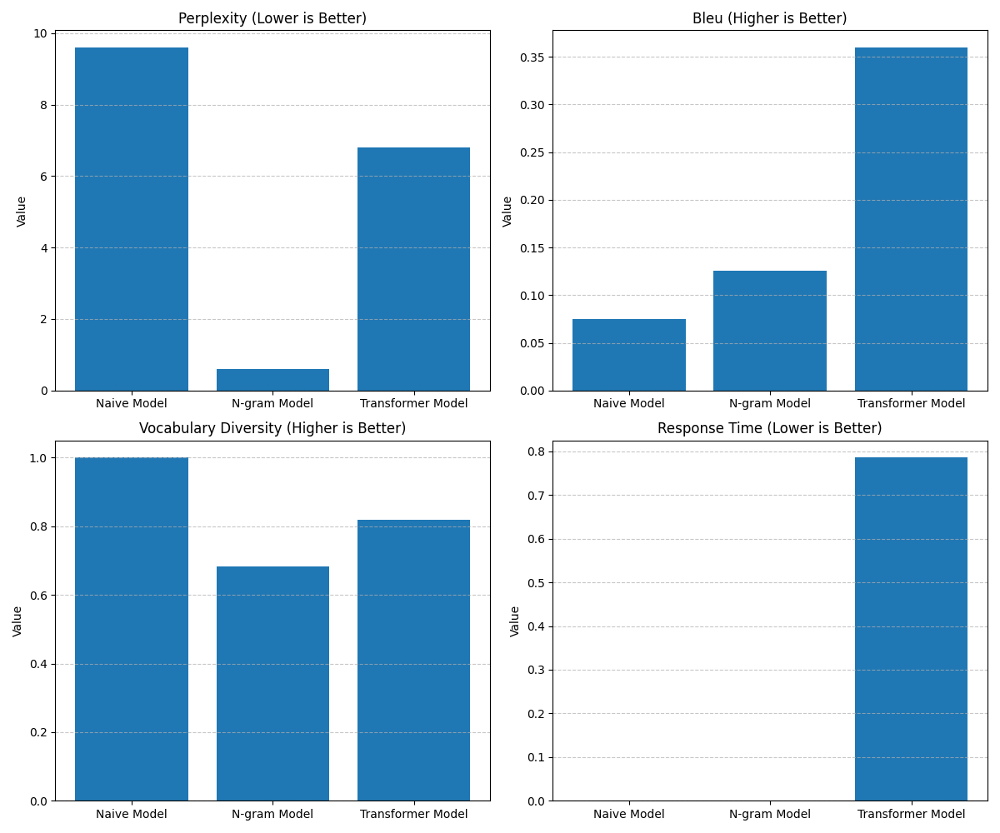

# DynamicTales: Interactive Storytelling

An interactive text adventure application that demonstrates and compares three different approaches to story generation:

1. **Naive Model** (baseline): A simple template-based text generator
2. **N-gram Model** (non-deep learning): Statistical language model based on n-grams
3. **Transformer Model** (deep learning): Neural network based on the GPT-2 architecture



## Overview

This project creates an interactive storytelling experience where users can make choices that affect the narrative, with the story being dynamically generated by one of the three available models. The application includes:

- Interactive text-based adventure game interface
- Real-time story generation responding to user choices
- Model comparison with performance metrics visualization
- Evaluation framework for quantitative model comparison

## Data Sources

The models are trained on a collection of public domain literary works from Project Gutenberg, focusing on:
- Classic literature
- Detective/noir fiction
- Adventure stories

These texts are processed into training segments of 100-1000 characters to create context-continuation pairs for model training.

## Model Evaluation Results

| Model | Perplexity (↓) | BLEU Score (↑) | Vocabulary Diversity (↑) | Response Time (↓) |
|-------|----------------|----------------|--------------------------|-------------------|
| Naive Model | 9.6000 | 0.0754 | 1.0000 | 0.0000 |
| N-gram Model | 0.6000 | 0.1258 | 0.6820 | 0.0002 |
| Transformer Model | 6.7953 | 0.3598 | 0.8187 | 0.7855 |

*↓ lower is better, ↑ higher is better*

## Demo

Try the live demo on [Hugging Face Spaces](https://huggingface.co/spaces/reinashi/DynamicTales).

## Key Features

- **Interactive Storytelling**: Engage with a dynamically generated narrative
- **Multiple AI Models**: Compare three different text generation approaches
- **Performance Metrics**: Visualize and compare model performance
- **User Choices**: Both predefined choices and free-form text input
- **Custom Objectives**: Narrative goals based on story context

## Installation

### Prerequisites

- Python 3.8+
- pip package manager

### Setup Instructions

1. Clone the repository:
```bash
git clone https://github.com/yourusername/DynamicTales.git
cd DynamicTales
```

2. Install dependencies:
```bash
pip install -r requirements.txt
```


## Usage

### Running the Application Locally

```bash
streamlit run app.py
```

The application will be available at http://localhost:8501

### Model Evaluation

To evaluate model performance:

```bash
python scripts/evaluation.py
```

This will:
- Generate text samples from each model
- Calculate metrics (perplexity, BLEU score, vocabulary diversity, response time)
- Save results to `data/outputs/evaluation_results.csv`
- Create a comparison visualization at `data/outputs/model_comparison.png`

## Project Structure

```
├── README.md               <- This file
├── app.py                  <- Main Streamlit application
├── requirements.txt        <- Python dependencies
├── setup.py                <- Setup script for project initialization
├── scripts/                <- Python scripts
│   ├── naive_model.py      <- Naive template-based model
│   ├── non_dl_model.py     <- N-gram statistical model
│   ├── deep_learning_model.py <- Transformer-based model
│   ├── evaluation.py       <- Model evaluation script
│   ├── build_features.py   <- Data processing utilities
│   └── make_dataset.py     <- Data collection utilities
├── models/                 <- Saved models
│   ├── naive_model.pkl     <- Serialized naive model
│   ├── ngram_model.pkl     <- Serialized n-gram model
│   └── transformer/        <- Transformer model files
│       ├── config.json
│       ├── generation_config.json
│       ├── tokenizer_config.json
│       └── model.safetensors
├── data/                   <- Data files
│   ├── raw/                <- Original data files
│   ├── processed/          <- Processed data ready for 
│   └── outputs/            <- Generated outputs (metrics, plots)
└── space.yaml              <- Hugging Face Spaces configuration


```

## Ethics Statement

The DynamicTales system generates content based on its training data, which may reflect biases present in historical literature. We've implemented several mitigations:

Careful curation of training sources to minimize harmful content
Filtering mechanisms to prevent generation of inappropriate material
Clear labeling of AI-generated content

Despite these measures, the system may occasionally produce unexpected or problematic outputs. Users should be aware of these limitations and exercise judgment when using the system.